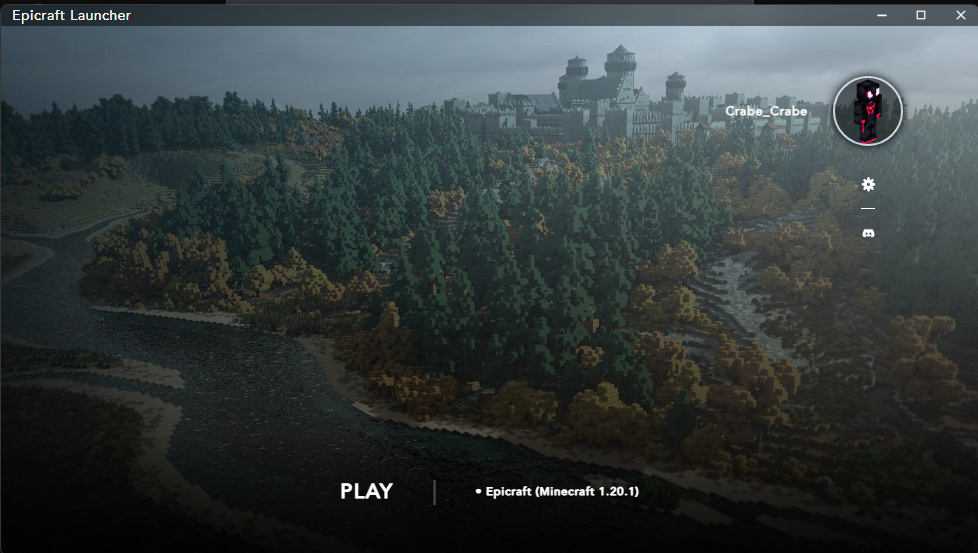

<h1 align="center">Epicraft Launcher</h1>

<h5 align="center">Launcher FAIT et POUR les étudiants d'Epitech pour le serveur Minecraft Epicraft ! Pas besoin de télécharger un .zip contenant les mods quand le launcher peut le faire pour vous !</h5>
<em><h5 align="center">(made by [Lucas Lhomme](https://github.com/LucasLhomme) and [Jawed Lahrouri](https://github.com/jawedlahrouri))</h5></em>

---



### Commencer

**Prérequis système**

* [Node.js][nodejs] v20

---

**Cloner et installer les dépendances**

```console
> git clone git@github.com:Crabe-Corp/Epicraft-Launcher.git
> cd Epicraft-Launcher
> npm install
```

---

**Lancer l'application**

```console
> npm start
```

---

**Compiler les installateurs**

Pour compiler pour votre plateforme actuelle.

```console
> npm run dist
```

Compiler pour une plateforme spécifique.

Lien du discord: https://discord.gg/jFbF7RtVHz

Le launcher est un fork du HeliosLauncher.

source:

[wiki]: https://github.com/dscalzi/HeliosLauncher/wiki
[nebula]: https://github.com/dscalzi/Nebula
[nodejs]: https://nodejs.org/en/
